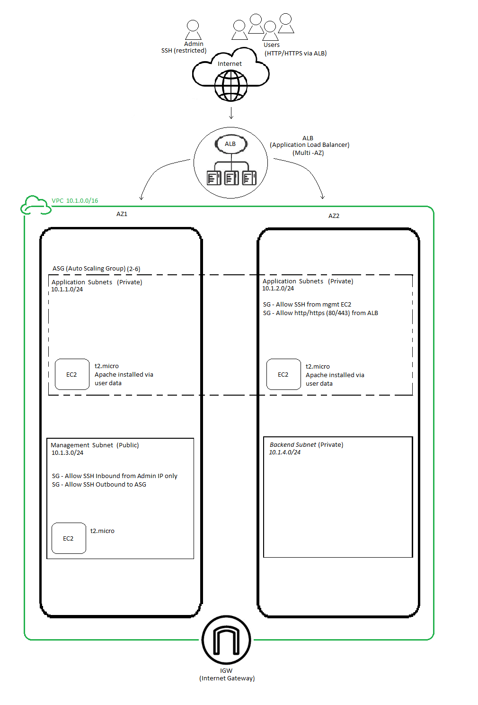

# CF SRE Technical Challenge – Comfort Benton

This repository contains my approach to the CF SRE Technical Challenge. The goal was to design and deploy a multi-tier, highly available web application environment in AWS using Terraform. The architecture includes a VPC, public and private subnets across two Availability Zones, an Internet Gateway, an Application Load Balancer, an Auto Scaling Group of Apache web servers, a backend subnet, and a dedicated management instance for secure administrative access.

I built the infrastructure using Terraform and tested the configuration locally using LocalStack and Docker.

---

## 1. Architecture Diagram

---

## 2. Challenge Requirements (My Interpretation)

Based on the instructions provided, the solution needed to include:

- One VPC with CIDR `10.1.0.0/16`
- Three subnetted groups spread evenly across two Availability Zones
- Proper network segmentation
- Public management access
- Private application subnets
- Backend subnet
- EC2 running Apache in an Auto Scaling Group
- Application Load Balancer routing traffic to ASG hosts
- Management EC2 instance for SSH access
- Security groups enforcing least privilege
- Terraform modules or structured configurations
- Architecture diagram
- README including commentary, design reasoning, and operational improvements

I chose to build four subnets for the three groups instead of three to avoid combining application and backend workloads, and to satisfy AWS design principles that subnets do not span Availability Zones.

---

## 3. Architecture Decisions

Before writing any code, I created the architecture diagram. Working through a few versions helped me clearly define:

- Each subnet’s purpose
- How to separate public vs private routing
- The path of user traffic
- How the admin SSH path should work
- Where the ASG should span
- How the ALB fits into the design
- Which components belong in AZ1 vs AZ2

### Final Architecture Summary

#### VPC
- CIDR: `10.1.0.0/16`
- Attached Internet Gateway (IGW)

#### Availability Zones
**AZ1**
- Application Subnet A (private)
- Management Subnet (public)

**AZ2**
- Application Subnet B (private)
- Backend Subnet (private)

#### Public Routing
- Dedicated publi
